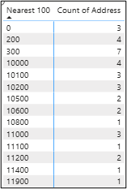
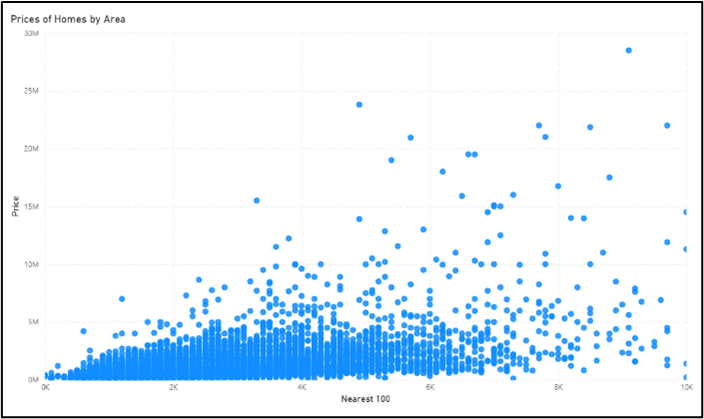
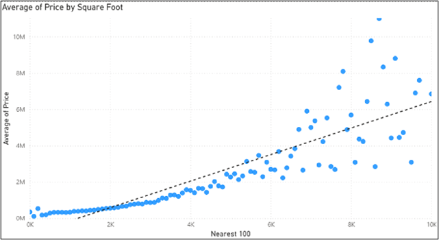

# US House Prices

## Executive Summary
This project is to explore if the price of homes within US cities is impacted by the area of the living space. Within Power BI a linear regression model is produced by using the dataset showing the sale price of properties and the square foot of living spaces. The visualisations can be used to identify any correlation between the two variables. Although initial analysis and graphs show there is a positive correlation between homes with larger areas being more expensive, when further explored using the R squared value it is noted that the increase in prices cannot be confidently explained by the area of the property.  The model can be used a guide to understand price of properties based of the factor of area but to improve the accuracy of the predications further models would need to be produced such as graphs for each city. 

## Data Infrastructure & Tools
A public dataset from Kaggle has details on the sale of houses from the top 50 populated cities in the United States (Jeremy Larcher, 2023). The data has details of the property such the location, the price, the number of beds and bathrooms, and living space area. The data included in the file has been collected from different sources. 

For the project, the data was uploaded to Power BI which is a unified, scalable platform that can connect to and visualise any data (Microsoft, 2025). It was chosen for analysis as it can handle large datasets and due to the various visualisation methods, that can provide useful insights to the end user. As Power BI can manage larger datasets, the graphs produced in this project can be recreated with more data. For example, having a dataset that included house sales for all of the United States. Whereas Excel is more limited in maximum number of rows that can be used so would not be an appropriate software to use for this project.  

## Data Engineering
From the dataset extracted from Kaggle, the main data points of interest were the areas of living space and the price of houses. Once the data was loaded into Power BI, data quality checks were completed to identify any issues that would impact the analysis. For the living spaces there are large range of areas recorded from 2 to 74340 square foot. Considering the context of the data this would show there are some data quality issues as it is unlikely the living space would be 2 square feet; this shows there are some inaccuracies in the data which reduces the reliability of the dataset. Due the large variation of the data, I added a new DAX column to the Power BI table to round the living space areas to the nearest hundred which helped group the data together when producing the visualisations. Using the new column, a table was produced to show which areas had a low number of records as this helped to identify anomalies and areas with low number of records (Table 1).

*Table 1: A section of the table used to identigy anomalies*

The dataset does not specify what year(s) the data was from which limits the understanding of the data as if it is based on old house prices it would not provide an accurate reflection of the current cost of houses. Additionally, not all data sources were stated on Kaggle which can reduce the validity of the data depending on where it originated from.

For houses included all the columns are completed and are filled out in a consistent format but the data only covers 50 American cities and there are few houses included for some living space areas. The dataset could be improved by including cost of homes across the whole country to provide a more accurate average. 

## Data Visualations & Dashboard
A scatter graph was produced using the the rounded square foot column and the prices of the homes (Graph 1). Scatter graph was the chosen visulation method as it allows for each data point to be represented and would be the most suitable for the linear regression model. 

Using the table to help identify anomlies, properties with an area greater than the 10,000 square foot were filtered out of the graph. By removing this homes, 99.8% of the dataset were still included in the visualisation and by eliminating the anomolies the graph interpreatabilty improved. 

*Graph 1:Prices of Home by Area rounded to the nearest 100, where area is under 10,000 square feet*

Due to the volume of data, it was difficult to interpret the graph and to notice any trends with the prices of houses. To improve the understanding of the data an additional graph was produced using the average sale price of homes for each area interval and a trend line was included to see the relationship between the two variables.  Graph 2 is easier for the end user to understand and provides clearer insights into the data.

*Graph 2: Prices of Home by Area for all homes*

## Data Analysis
The hypothesis for the project is that the properties would be more expensive the larger the area of the home. By creating a liner regression model this helps to understand the relationship between the two variables.

On the graph using the average prices a trend line was added to create a linear regression model to be able to predict a guide price of homes based on the living space area. The linear regression model has a positive correlation showing the price homes increases based on the size of the properties. There is a strong correlation up until homes are larger than 6000 square feet where the correlation becomes weaker meaning the predictions would become less reliable.

There are anomalies in the data where additional factors need to be taken into consideration such as the area of the homes that have included, and the number of properties included within the average. To further improve the analysis producing individual graphs for each city would allow for a better understanding of the factors impacting price and would be more beneficial to the end user when researching house prices for their area.

Creating a new table in Power BI using the LINEST function produced the statistical information for the data used. It outputs the Regression Sum of Squared and the Residual Sum of Squared, using both of this a new column was added to calculate the R squared value. A value of 0 indicates the response variable cannot be explained by the predictor variable (Zach Bobbitt, 2022) The R squared value for this linear regression is 0.37 which shows that the prices of homes cannot be confidently explained by the area of the living area. To improve the model having a larger dataset would provide a more accurate average to us in the model. As the current model only includes the top 50 cities in the US it does not provide an accurate representation of the whole country, by creating graphs specific to each city or state would help provide more reliable information for each area.

## References
-[Jeremy Larcher (Kaggle), 2023, American House Prices](https://www.kaggle.com/datasets/jeremylarcher/american-house-prices-and-demographics-of-top-cities)
-[Microsoft, 2025, Power BI- What is Power BI?](https://www.microsoft.com/en-us/power-platform/products/power-bi/?msockid=0833d1a9557462932946c09c517464ca)
-[Zach Bobbitt, 11th May 2022, A Gentle Guide to Sum of Squares: SST, SSR, SSE](https://www.statology.org/sst-ssr-sse/)

-Jeremy Larcher (Kaggle), 2023, American House Prices, American House Prices, Accessed 4th July 2025
-Microsoft, 2025, Power BI- What is Power BI? [Online], Power BI - Data Visualization | Microsoft Power Platform,  Accessed 22nd August 202
-Zach Bobbitt, 11th May 2022, A Gentle Guide to Sum of Squares: SST, SSR, SSE [Online], A Gentle Guide to Sum of Squares: SST, SSR, SSE, Accessed 25th July 2025
